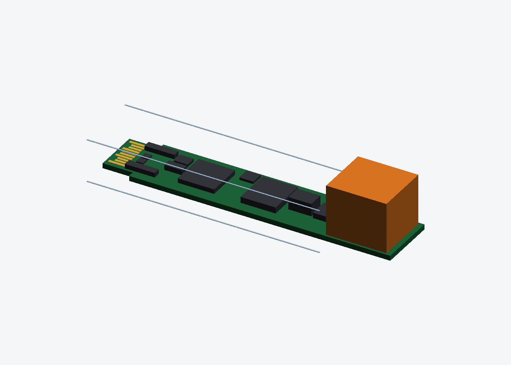

# sfp-auto-ethernet

SFP 모듈 세 가지. 일반 SFP 슬롯에 꽂으면 호스트와 **SGMII**로 붙고, 바깥쪽은 차량 이더넷이나 RJ45로 나간다.

| 변형 | 바깥쪽 | PHY | 커넥터 | 상태 |
|---|---|---|---|---|
| [`t1`](hw/t1/) | **100/1000BASE-T1** | TI DP83TG720S (1000) / DP83TC812S (100) — 핀 호환이라 PCB 하나로 둘 다 | H-MTD | v0 배치 |
| [`rj45`](hw/rj45/) | 1000BASE-T | TI DP83869HM | 저프로파일 RJ45 | v0 배치 |
| [`t1s`](hw/t1s/) | 10BASE-T1S | Lattice CrossLink-NX (SGMII 브리지) + Microchip LAN8670 | 2핀 | v0 배치 |



## 구조

```
 host SFP cage ── SGMII 1.25 Gbaud (AC 결합, 모듈 안) ──┐
                                                        ▼
 I²C 0x50/0x51/0x56 ── STM32G031 ── MDIO ──►  PHY  ── CMC / ESD ── 커넥터
 TX_DISABLE · RX_LOS ──┘                        ▲
 3.3 V ── 필터 ── 벅 1.0/1.1 V · LDO 2.5/1.8 V ─┘
```

- MCU 하나가 세 가지 일을 맡는다. 호스트 쪽에서는 EEPROM(A0h/A2h)이자 PHY 브리지(I²C 0x56)로 보이고, 링크 제어도 한다. 리눅스 `sfp` 드라이버가 기대하는 방식을 그대로 따랐다([docs/LINUX.md](docs/LINUX.md)).
- **데이터시트가 공개된 부품만 쓴다.** NDA가 필요한 PHY로는 설계도 유지보수도 못 한다. 88Q2112를 고르지 않은 이유다([docs/PARTS.md](docs/PARTS.md)).
- **T1S는 SGMII를 지원하는 PHY가 없다.** 그래서 작은 FPGA가 SGMII 10 Mb/s를 받아 MII로 변환하고, 반이중 버퍼도 맡는다. 게이트웨어가 필요해서 셋 중 가장 손이 많이 간다.

## 지금 된 것 (v0: 기구)

`python3 hw/make_boards.py`를 돌리면 아래가 만들어진다.

- **SFP 모듈 에지 커넥터 풋프린트**
  - `hw/fp/sfp.pretty/SFP_Module_Edge.kicad_mod`
  - INF-8074i Figure 2/3의 치수를 그대로 썼다: 0.8 피치, 0.6 폭, 윗면 +3.8/−3.4, 접지 0.5 · 전원 0.9 · 신호 1.3의 계단 배치.
  - 정리는 [docs/SFP_MSA.md](docs/SFP_MSA.md)에 있다.
- **변형 3종의 KiCad PCB**
  - 외형: 탭 폭 9.2, 몸통 폭 12.4
  - 에지 커넥터, 모든 부품 배치, 케이지 앞면 표시선
  - 4층
- **외피 검사**
  - 케이지 안쪽 부품이 높이 한도(PCB 위 4.65 mm, 아래 1.65 mm)를 넘지 않는지 본다.
  - 부품끼리 겹치지 않는지, 에지 핑거 위에 올라간 부품이 없는지도 본다.
  - 코에 달린 커넥터가 13.7 mm 폭을 넘지 않는지 본다.
  - **지금은 세 변형 모두 통과한다.**

## 다음

1. **회로도**
   - T1부터 시작한다. DP83TG720 데이터시트의 핀 표에서 SGMII, MDIO, 스트랩, 전원 순서를 옮긴다.
   - STM32 펌웨어의 I²C → MDIO 브리지 사양도 이 단계에서 정한다.
2. **배선**
   - SGMII 100 Ω 차동 쌍, 핀에서 AC 캡과 PHY까지를 최단으로 잡는다.
   - 4층 적층: 신호 / GND / 전원 / 신호
3. **자리만 잡아 둔 부품 확정**
   - H-MTD 헤더 (Rosenberger)
   - 저프로파일 RJ45 + 4쌍 자기 소자
4. **하우징**
   - 인쇄 셸이나 기성 SFP 셸
   - 래치와 베일도 포함해야 한다.
5. **주문**
   - 에지 핑거는 **하드 골드와 베벨**로, 두께는 1.0 mm.

## 참고

- 비슷한 상용 제품이 있다. 그러니 이 크기 안에 들어간다.
  - [Intrepid 88Q2112 SFP](https://intrepidcs.com/products/automotive-ethernet-tools/88q2112-1000base-t1-sfp/): 76.5 × 13.5 × 20.5 mm, H-MTD
  - [Technica TE-1441](https://technica-engineering.de/en-gb/hardware-products/sfp-sfp-modules): I²C → MDIO 게이트웨어, DIP 스위치
- 10G RJ45 SFP+는 만들지 않는다. 10GBASE-T PHY는 2.5–5 W를 쓰고, 10.3 Gbaud 신호 무결성까지 챙겨야 해서 사는 편이 맞다.
