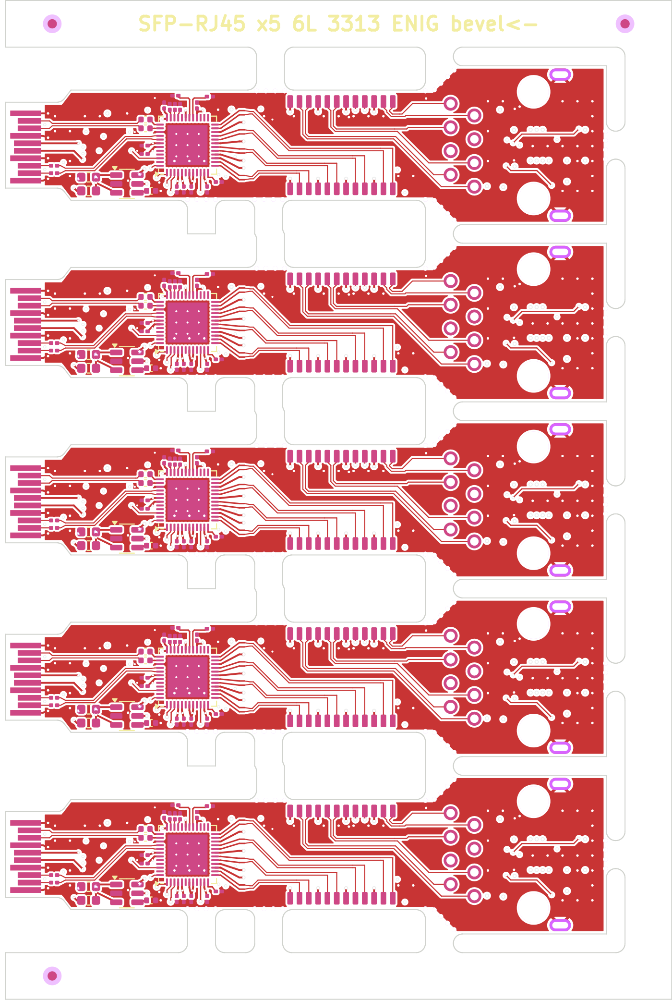

# RJ45 SFP order sheet (JLCPCB, budget under 500,000 KRW)

Upload the files in `jlc/` as they are (`python3 panel_rj45.py` makes them).

| File | What it is |
|---|---|
| `jlc/rj45-panel-gerbers.zip` | 5-board panel, **71.5 × 107.1 mm**. Gerbers (6 copper layers, masks, silks, paste, outline) + drill |
| `jlc/bom-rj45.csv`, `jlc/cpl-rj45.csv` | BOM 25 lines, CPL **320 placements** (125 top, 195 bottom; designators `R4_1…R4_5`). The jack J2 is in both (through-hole, JLC fits it) |
| `jlc/panel-drc.rpt` | Panel DRC with the board's own rules: **0 errors, 0 unconnected**. All 161 findings are warnings ("library not in this project" for the placed footprints and KiKit's mouse-bite holes); they don't reach the gerbers |
| `jlc/panel-top.png` | Panel preview. The gold fingers sit on the left edge |

The tabs are placed by hand (`TABS` in `panel_rj45.py`). The body's long edges are lined with parts, and evenly spaced tabs put mouse-bite holes through C36/C37, then through X1/R12.

## PCB options (JLC order form)

| Field | Value | Why |
|---|---|---|
| Layers | **6** | |
| Dimensions | panel (in the gerbers) | a single board is below the gold-finger minimum (50 mm per side) and the PCBA minimum (70 × 70) |
| Thickness | **1.0 mm** | SFP MSA: 1.0 ± 0.1 over the fingers |
| Stackup | **JLC06101H-3313** | the same 3313 prepreg under F and B as the 4-layer T1, so the pairs are 0.114 lines / 0.152 gap ≈ 100 Ω differential |
| Impedance control | **yes** | |
| Via covering | **epoxy filled and capped (POFV)** | 25 vias sit in SMD pads (U1's and U4's exposed pads, C17, C40, TP5); free on 6 layers |
| Min via | **0.2 drill / 0.35 pad**; hole to copper 0.2 mm | 0.2 mm is JLC's smallest drill without a surcharge |
| Surface finish | **ENIG** | required for gold fingers |
| Gold fingers | **yes**, bevel **45°**, **the panel's left edge** | every board's fingers sit on that edge |
| PCB quantity | 5 panels (25 boards' worth of PCB) | |
| Panel by JLC | no (we supply the panel) | |

As on the T1: JLC's fingers are ENIG-grade gold, not the MSA's hard gold. That is good for tens of insertions on a bench.

## Assembly options

| Field | Value |
|---|---|
| Type | **Standard** |
| Sides | **both** (U1 and its decaps on top; the buck, oscillator and MCU underneath) |
| Quantity | 2 panels (the minimum) = 10 boards |
| Through-hole | J2 (the RJ45 jack), 10 joints per board |
| Files | `jlc/bom-rj45.csv` + `jlc/cpl-rj45.csv` |

**Check part rotations in JLC's 3D preview**, above all U1 (QFN-48, on top), T1 (the magnetics) and the jack.

## Stock (2026-09-30)

Every part is stocked at JLC; the tightest is the magnetics, LP72450ANL (800), which is plenty for 10 boards. See the table in [README.md](README.md).

## Estimated cost (10 boards, estimate)

| Item | USD |
|---|---|
| PCB: 5 panels, 6L 1.0 mm ENIG, POFV, gold fingers + bevel | 70–130 |
| PCBA setup (two-sided) + stencils | 51 + 16 |
| Part loading fees (~25 BOM lines, most extended, × $1.53) | ~35 |
| Through-hole jack, X-ray (QFN) | ~20 |
| Parts: 10 boards × ~$11, plus attrition | ~120 |
| Shipping (DHL) | ~20–25 |
| **Total** | **~330–400** |

At about 1,370 KRW/USD that is **about 450–550k KRW**: at the budget line. The 6-layer PCB is the unknown; JLC's quote form gives the real figure. To stay under it:
- order 3 panels of PCB instead of 5;
- or a 3-board panel (`python3 panel_rj45.py 3`), 2 of them assembled = 6 boards.
