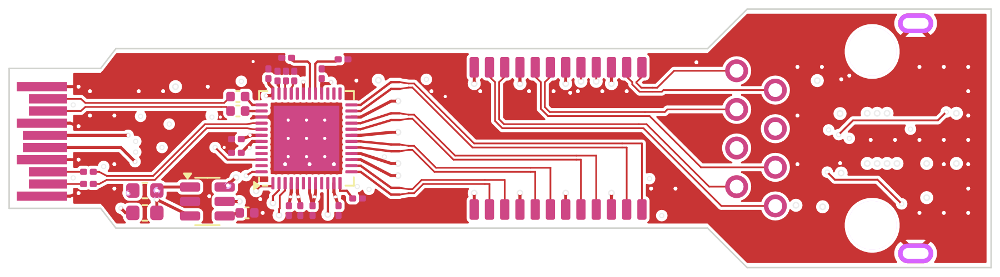
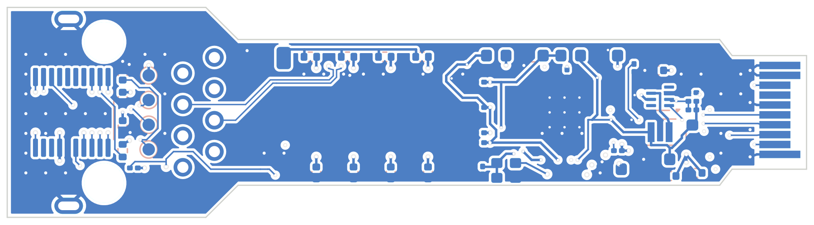

# RJ45 SFP: 100M / 1G / 2.5GBASE-T

A copper SFP built around the Realtek RTL8221B. It runs 2500BASE-X (3.125 Gbaud) or SGMII to the host, and 100M / 1G / 2.5GBASE-T on the jack.

Schematic, 6-layer PCB (routed), fab outputs and a JLC panel are all in place.
**Order files are in [`jlc/`](jlc/), and the order sheet is [ORDER.md](ORDER.md).** Nothing has been built.

| Top | Bottom |
|---|---|
|  |  |

## Status

| | Result | How it was checked |
|---|---|---|
| Schematic | **ERC 0 errors, 0 warnings** ([erc.rpt](erc.rpt)) | eeschema's own ERC (`run_erc.sh`) |
| Placement | 70 footprints, no overlaps; housing height limits met | `make_rj45.py` |
| Routing | **DRC 0 violations, 0 unconnected** ([drc.rpt](drc.rpt)) | hand-laid pairs and buses, Freerouting 1.9.0 for the rest, then KiCad DRC |
| KiCad 9 | **DRC 0 errors, 0 unconnected, schematic parity clean, ERC 0 errors** ([kicad9-drc.rpt](kicad9-drc.rpt), [kicad9-erc.rpt](kicad9-erc.rpt)) | `sh ../check_kicad9.sh rj45`: the official KiCad 9 image. Only warnings are "differs from the library copy" |
| Fab | Gerbers + drill ([fab/rj45-gerbers.zip](fab/rj45-gerbers.zip)), [BOM](fab/rj45-bom.csv), [CPL](fab/rj45-cpl.csv), [1:1 print](fab/rj45-1to1.pdf) | `export_rj45.py` |
| Panel | 5 boards, 71.5 × 107.1 mm, **DRC 0 errors, 0 unconnected** with the board's rules ([jlc/panel-drc.rpt](jlc/panel-drc.rpt)) | `panel_rj45.py` (KiKit) |
| Pair lengths | [lengths.txt](lengths.txt) | `make_rj45.py` |

## Parts (all in JLC stock, 2026-09-30)

| | Part | LCSC | Stock |
|---|---|---|---|
| PHY | Realtek RTL8221B-VB-CG | C5155988 | 4564 |
| Magnetics | LINK-PP LP72450ANL (2.5G, 4 channels, 15.2 × 7.1 × 4.3 mm) | C53281905 | 800 |
| Jack | Kinghelm KH-RJ45-58-8P8C, shielded, no magnetics | C2683360 | 2717 |
| Clock | MST8011AI 25 MHz oscillator (≤ 2 ps RMS jitter, as the PHY asks) | C51026225 | 898 |
| Core 0.946 V | TPS62822 buck, 57.6k / 100k | C473385 | 2288 |
| Inrush | TPS22918 load switch, 2.2 nF CT (≈ 3.6 ms) | C131941 | 12874 |
| MCU | STM32G031F6P6 | C529333 | 1454 |

Parts come to about $11 a board.

## Board

- The body is 11.8 mm wide up to the cage front. From there a 17 mm nose carries the jack, which sits entirely outside the cage. The board is 64.4 mm long.
- **Six layers, JLC06101H-3313.** The same 3313 prepreg (0.0994 mm, Dk 4.1) sits under F and B as on the 4-layer stack, so the pairs keep 0.114 mm lines with a 0.152 mm gap (≈ 100 Ω differential).

  | Layer | Use |
  |---|---|
  | F | U1 and its decaps, both SerDes pairs, the MDI pairs under the magnetics, the line side |
  | In1 | GND |
  | In2 | the slow lines, hand-laid end to end (fingers and U1 to the MCU) |
  | In3 | +3V3 plane |
  | In4 | GND |
  | B | the buck, the power-entry caps, the oscillator and analog beads, line pair 2, the MCU |

- **Why six:** on four layers every signal routed, but the PHY's power pins did not all reach their rails. They sit 0.4 mm apart with their decaps right next to them. Here every +3V3 pad has its own via into the In3 plane.
- **Pairs, all laid by hand and coupled** (`make_rj45.py`):
  - SerDes to the host. U1 sits on top, turned 90°. Its pins 37–41 read HSON, HSOP, HSIP, HSIN top to bottom, the order of the SFP edge's RD−, RD+, TD+, TD− (SFF-8419 Figure 7-2). Both pairs run straight, P to P, on top, with no via.
    (Until 2026-10 the edge was drawn mirrored and U1 sat underneath for the same reason; `make_rj45.py` turns that group over.)
  - The four MDI pairs run on top under the magnetics' body and straight into its chip-side pads, in port order: port 0 on channel 1 (jack 1/2) … port 3 on channel 4. CFG_OPT1 is pulled down, so there is no MDI swap.
- **PHY address straps:** the RTL8221B has no internal pulls on its CONFIG pins (datasheet 7.18: an external pull-high or pull-low is required). LED0/1/2 carry PHYAD[2:0]: R19-R21, 4.7 kΩ to ground, give 000, which the PHY treats as address 1 (Table 16 note 2), the address the firmware uses. Three 0201s right above pins 33-35 on top; C16 moved underneath its via and C17 0.3 mm west to make room.
  - Line pairs 0, 1 and 3 run on top in lanes 0.8 mm apart.
  - Line pair 2 (jack pins 4/5) drops to the bottom under its pads. Pair 3/6 straddles 4/5 on the jack, so one of those two pairs has to leave the top side.
- **The MCU sits under the jack.** It is the only place with room. Its ten slow lines run on In2, laid by hand from end to end:
  - they leave the fingers and U1 through vias;
  - they run in the board's lane order to the jack's pin field;
  - they cross the field in three lanes of three, plus MDIO underneath.
  - The MCU's GPIOs are assigned to match the lane order, not the T1 board's: PA0 MDIO, PA1 MDC, PA4 TX_FAULT, PA5 TX_DISABLE, PA6 RX_LOS (`fw/main.c`, `VARIANT_RJ45`).
- **In2 keepouts:** the MDI and line pairs are 2.5GBASE-T at 200 MBd PAM16, so In2 lines may cross under them. On six layers the bottom pairs reference In4 GND anyway.

## Regenerating

```bash
python3 make_rj45.py            # symbols, footprints, schematic, placed PCB
python3 make_rj45.py --route    # planes, dogbones, Freerouting, pours, repairs, DRC -> drc.rpt
sh run_erc.sh                   # eeschema ERC -> erc.rpt
sh ../check_kicad9.sh rj45      # the same board in KiCad 9
python3 export_rj45.py          # gerbers (6 copper layers), BOM, CPL, previews, 1:1 PDF -> fab/
python3 panel_rj45.py           # 5-board panel + JLC files -> jlc/
```

## Not verified

- Nothing has been built.
- **Firmware for this variant** (`fw/`, `VARIANT=rj45`) builds, but has never run. Check:
  - the MDIO access to the RTL8221B;
  - 2500BASE-X / SGMII selection;
  - LED / link reporting.
- **Jack land:** it is drawn from Kinghelm's drawing by hand. Print `fab/rj45-1to1.pdf` at 100 % and set a real jack on it.
- **Fit next to other modules:** the jack is 15.7 mm wide, against 13.7 mm for a copper SFP's housing. It may touch its neighbour in a ganged cage (for example on the D10). Measure it.
- **Inrush and the 0.95 V rise time:** measure them.
