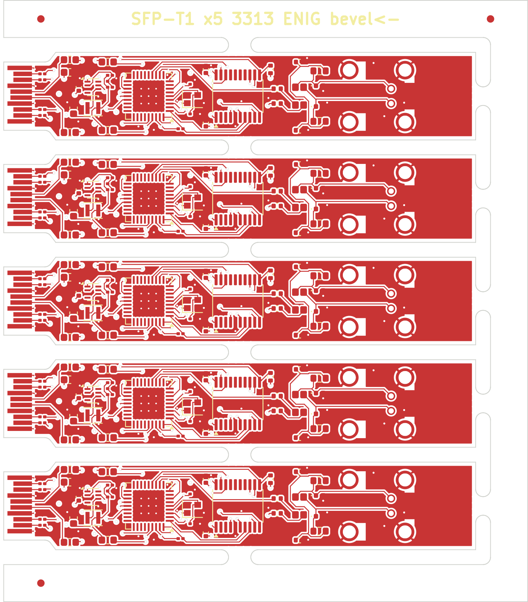

# T1 SFP order sheet (JLCPCB, budget under 500,000 KRW)

Upload the files in `jlc/` as they are (`python3 panel_t1.py` makes them).

| File | What it is |
|---|---|
| `jlc/t1-panel-gerbers.zip` | 5-board panel, **70.6 × 81.1 mm**. Gerbers (4 copper layers, masks, silks, paste, outline) + drill |
| `jlc/bom.csv` | Comment / Designator / Footprint / LCSC Part #, 27 lines |
| `jlc/cpl.csv` | Designator / Mid X / Mid Y / Layer / Rotation, **265 placements** (53 per board × 5, designators `R4_1…R4_5`) |
| `jlc/panel-drc.rpt` | Panel DRC: **0 errors, 0 unconnected**. The 81 warnings are all "library not in this project" for the placed footprints and KiKit's mouse-bite holes; they don't reach the gerbers |
| `jlc/panel-top.png` | Panel preview. The gold fingers sit on the left edge |

## PCB options (JLC order form)

| Field | Value | Why |
|---|---|---|
| Layers | 4 | |
| Dimensions | panel (in the gerbers) | a single board is below the gold-finger minimum (50 mm per side) and the PCBA minimum (70 × 70) |
| Thickness | **1.0 mm** | SFP MSA: 1.0 ± 0.1 over the fingers |
| Stackup | **JLC04101H-3313** | SGMII/MDI widths are calculated for this stackup (50 Ω = 0.157 mm) |
| Impedance control | **yes** | free |
| Surface finish | **ENIG** | required for gold fingers |
| Gold fingers | **yes**, bevel **45°**, **the panel's left edge** | every board's fingers sit on that edge |
| Min via | 0.25 drill / 0.45 pad | |
| PCB quantity | 5 panels (25 boards' worth of PCB) | |
| Panel by JLC | no (we supply the panel) | |

JLC offers **no electroplated hard gold**, so the fingers get ENIG-grade gold, good for about 25 insertions. That is enough for prototypes.

## Assembly options

| Field | Value |
|---|---|
| Type | **Standard** (Economic can't do 0201 or gold fingers) |
| Sides | **both** (the decaps are on the bottom, under the PHY) |
| Quantity | 2 panels (the minimum) |
| Files | `jlc/bom.csv`, `jlc/pos.csv` |

**Check part rotations in JLC's 3D preview.** Some QFN/TSSOP footprints have a different zero angle in KiCad and in JLC's library. Rotate on the preview screen if needed.

## The PHY: the only stock problem

| | Part | LCSC | Stock (2026-09-29) | Price |
|---|---|---|---|---|
| 1000BASE-T1 | DP83TG720SWRHARQ1 | C2921292 | **3** | $12.3 |
| (same part, different reel) | DP83TG720SWRHATQ1 | C3225809 | 3 | $10.0 |
| 100BASE-T1 | DP83TC812SRHARQ1 | C3225813 | 18 | $4.05 |

A 5-board panel × 2 panels = **10 PHYs needed**. Pick one:

1. **1000BASE-T1, parts from JLC Global Sourcing.** Add 10 × DP83TG720SWRHARQ1 via "Order Parts" from DigiKey/Mouser (TI has plenty), wait for them to reach your parts library, then place the PCBA order. Adds about 1–2 weeks.
2. **100BASE-T1 first run (in stock now).**
   - In the BOM, change U1 to C3225813 and **delete the FB3 line** (the TC812 regulates its own core).
   - Same board, same firmware.
   - Cheapest, and it proves the design end to end.
3. **Smaller panel:** `python3 panel_t1.py 3` gives 3 boards × 2 panels = 6 boards. But one BOM can list only one C-number and each reel has only 3, so this still needs global sourcing.

## Estimated cost (10 boards, estimate)

| Item | USD |
|---|---|
| PCB: 5 panels, 4L 1.0 mm ENIG + gold fingers + bevel | 40–80 |
| PCBA setup (two-sided) + stencil | 51 + 16 |
| Part loading fees (~27 extended parts × $1.53) | ~41 |
| X-ray (QFN), solder joints | ~20 |
| Parts: 10 boards, **TG720** / **TC812** | ~180 / ~120 |
| Shipping (DHL) | ~20–25 |
| **Total** | **~370–410 / ~310–350** |

At about 1,370 KRW/USD:
- **1000BASE-T1: about 510–560k KRW (slightly over budget)**
- **100BASE-T1: about 425–480k KRW (within budget)**

Separately: the H-MTD connector (Rosenberger E6S20A-40MT5-Z, from Mouser) costs a few thousand KRW each × 10. It is soldered by hand after depaneling.

To get the gigabit run under 500k:
- change some 0201 caps to basic 0402 parts (cuts the loading fees),
- or order 1 panel + have 1 panel assembled, if JLC's minimum allows it.

## Before you order

- [ ] Check the SGMII/MDI widths again in JLC's impedance calculator: 50 Ω single-ended at 0.157 mm on 3313, **outer layers** (the pairs never use In2)
- [ ] H-MTD J2: the footprint is drawn from Rosenberger MB_633. Check the hole positions against the gerbers once more
- [ ] Rotations in JLC's assembly preview
- [ ] Flash the firmware (`fw/`) through SWD on TP1–TP5 after assembly
