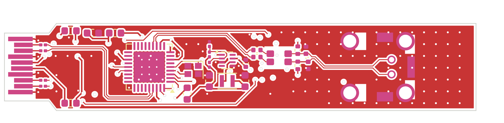
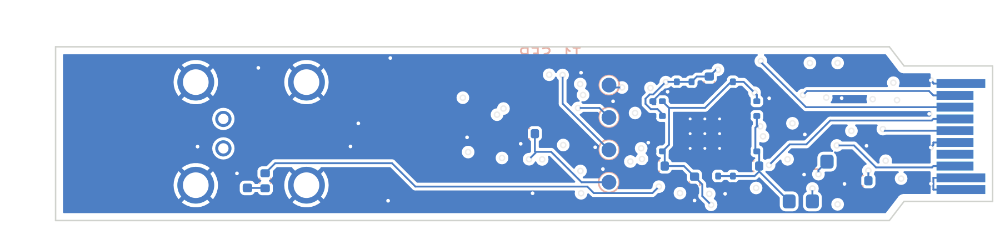

# T1 SFP: 100/1000BASE-T1

Schematic, PCB (4 layers, routed), fab outputs and firmware are all in place.
**Order files are in [`jlc/`](jlc/), and the order sheet is [ORDER.md](ORDER.md).** The only open choice is **which PHY to use** (TG720 stock problem).

| Top | Bottom |
|---|---|
|  |  |

## Status

| | Result | How it was checked |
|---|---|---|
| Schematic | **ERC 0 errors, 0 warnings** ([erc.rpt](erc.rpt)) | eeschema's own ERC (`run_erc.sh`) |
| Schematic ↔ netlist | 175 pins, 0 mismatches | Netlist exported with `kicad-cli sch export netlist`, compared against the netlist in `make_t1.py` |
| Placement | 62 parts, no overlaps; housing height limits met | `make_t1.py` |
| Routing | **DRC 0 violations, 0 unconnected** ([drc.rpt](drc.rpt)) | Freerouting 1.9.0, then KiCad DRC |
| Fab | Gerbers + drill ([fab/t1-gerbers.zip](fab/t1-gerbers.zip)), [BOM](fab/t1-bom.csv), [CPL](fab/t1-cpl.csv) | `export_t1.py` |
| Firmware | Builds: 1.7 KB flash / 280 B RAM, 0 warnings ([../../fw](../../fw)) | `make` |

## Circuit (every block is from its datasheet)

- **PHY:** DP83TG720S-Q1 (1000BASE-T1).
  - The **DP83TC812S-Q1 (100BASE-T1) fits the same footprint**. For the 100 Mb loadout, leave **FB3** unfitted (the 1.0 V buck → pins 9/21 ferrite); the TC812 regulates pin 21 itself.
  - The straps are all left at their defaults: SGMII, PHY address 0, autonomous, slave. The module links up with no MCU at all.
- **SGMII:** SFP TD/RD → 100 nF AC coupling inside the module (as the MSA requires) → PHY TX_P/M (32/33) and RX_P/M (24/23).
- **MDI (Figure 8-1 / Table 8-1):** TRD → 100 nF DC-block → DLW32MH101XT2 CMC → H-MTD. CM termination is 2 × 1 kΩ to a node, then 4.7 nF + 100 kΩ from the node to GND. ESD is optional and left unfitted.
- **Power (Figure 8-3 / Table 8-2):**
  - VDDA, VDDIO and VDD1P0 each get their own ferrite island.
  - Every power pin gets 10 nF + 100 nF; some also get 2.2 µF.
  - The decaps sit on the **bottom side**, in a ring under the PHY.
  - 1.0 V comes from a **TPS62822 buck**: 470 nH, 66.5 k / 100 k divider, 120 pF Cff.
  - Estimated module power **~0.7 W**, inside the SFP's 1.0 W power-up limit.
- **MCU:** STM32G031. It answers the host's I²C as the EEPROM (0x50) and the PHY bridge (0x56), and handles MDIO, TX_DISABLE and RX_LOS. See [`../../fw/`](../../fw/).

## Board

- 63.5 × 11.8 mm (the H-MTD overhangs a further 3.5 mm). The tab is 9.2 mm wide.
- Edge connector is the INF-8074i pattern (`../fp/sfp.pretty/SFP_Module_Edge`).
- 4 layers:

  | Layer | Use |
  |---|---|
  | F | signals + GND pour |
  | In1 | GND (solid) |
  | In2 | +3V3 pour + slow signals (MDIO, LEDs, straps); never a pair |
  | B | signals + GND pour |

- No pour among the edge fingers.
- The PHY's exposed pad gets 3 × 3 thermal vias to the planes.

## Changes for ordering (2026-09-29)

- **H-MTD J2 = Rosenberger E6S20A-40MT5-Z**, drawn from the layout drawing MB_633.
  - Ground holes Ø1.74 / pad 2.5, **7.0 × 7.5** apart. The research said 9.3, but that is the outer width of the hatched areas; I measured the drawing myself.
  - Signal holes Ø0.7, 2.0 apart, 1.87 behind the front row.
  - The hatched solder areas are GND pads, and the no-routing keep-outs are rule areas.
  - Overhangs the board edge by 3.5 mm. The body sits entirely outside the cage, so the board is 63.5 mm long.
  - LCSC has no stock: hand-solder it.
- **Stackup JLC04101H-3313.**
  - JLC's own SI9000 backend puts 50 Ω single-ended at 0.157 mm. The router doesn't couple pairs, so each line is routed at 50 Ω (checked: every SGMII/MDI segment on the board is 0.157 mm).
  - The SGMII and MDI classes may use **F and B only** (`CLASS_LAYERS`): F sits over In1's ground and B over In2's +3V3 pour, and the stackup is symmetric. Left free, the router had put SG_TX_P on B and SG_TX_N on In2.
  - Pair skew is at most **3.2 mm (≈21 ps)**, against an 800 ps SGMII UI and a 1.33 ns 1000BASE-T1 symbol ([lengths.txt](lengths.txt)).
  - TRD_P runs mostly on B and TRD_M on F, so across its 20 mm that pair is two 50 Ω lines rather than a coupled pair.
- **U1 pins 12/13 cross over on purpose.** They leave the package M-over-P and the CMC takes P-over-M, so on one layer they could not be routed. The DP83TG720 corrects MDI polarity itself, and that can't be disabled (datasheet 6.4.7.2), so pin 12 drives the line's M side. The SGMII pairs keep their true polarity. SGMII_CTRL_1 (0x608) bits 7/8 could invert them, but "RX bus" there is ambiguous, so the hardware doesn't rely on it.
- **Buck is the TPS62822** (the TPS62821 is out of stock at LCSC; same package, pins and divider).
- **Panel (`panel_t1.py`):**
  - 5 boards, mouse-bites, **rails on 3 sides only** so the gold-finger edge stays straight (`../panel_rails.py`).
  - KiKit 1.6.0 is the version that works with KiCad 7; its `fab jlcpcb` can't drive this plotter, so the gerbers, BOM and CPL are written by our own code.

## Regenerating

```bash
python3 make_t1.py            # symbols, footprints, schematic, placed PCB (with nets)
sh run_erc.sh                 # eeschema ERC -> erc.rpt (headless, Xvfb)
python3 make_t1.py --route    # + planes, Freerouting, SES in, pours, DRC -> drc.rpt
python3 make_t1.py --reuse-ses  # reuse t1.ses (Freerouting results vary from run to run)
python3 export_t1.py          # single-board gerbers, BOM, CPL, previews -> fab/
python3 panel_t1.py 5         # 5-board panel + JLC order files -> jlc/ (KiKit 1.6.0)
```

- The router is **Freerouting 1.9.0**, at `~/.local/share/freerouting/freerouting-1.9.0.jar`.
  - 2.x ignores the pass limit on the command line and never finishes on this board.
  - 1.9.0 needs a display, so it gets Xvfb `:98`.
- Freerouting's result changes on every run. **`t1.ses` in this repo is the run that came out DRC-clean.**
- Where the router kept failing, the design file lays copper before it runs, all locked:
  - `PREROUTES` / `PREVIAS`, hand-drawn:
    - EN→VIN of the buck, routed under U3 because the no-connect PG pin blocks the direct way;
    - escape vias for U1's MDC/INT/RST, which share one lane past the crystal;
    - spokes from the pin 11/21 decap row to U1's bottom EP pad;
    - a shared ground via for C10/C16 and one for R4.
  - A ground via beside every capacitor ("dogbone"), except where `NO_DOGBONE` says it blocks a lane: the crystal's load caps and C21.
- After routing, `sfpgen` repairs what is left, keeping each change only if DRC is no worse:
  - removes escape vias the router didn't use;
  - joins open signal links (straight, via bridge, or a T into an existing track), before stitching so those links get the space first;
  - lays the GND stitching grid, 1 mm off the long edges where the panel's mouse bites are;
  - vias into ground islands.
- The panel's mouse-bite holes sit 0.1 mm into the board (was 0.25): at 0.25 they came within 0.16 mm of an In2 trace.
- KiCad 7 quirks, recorded in the code:
  - Standalone `LoadBoard` does not read `.kicad_pro`, so the rules are set in memory (`apply_rules`).
  - A footprint must be added to the board before `Flip`, or it segfaults.
  - A pad's `SetPos0` is required, or every pad collapses to the footprint origin.
