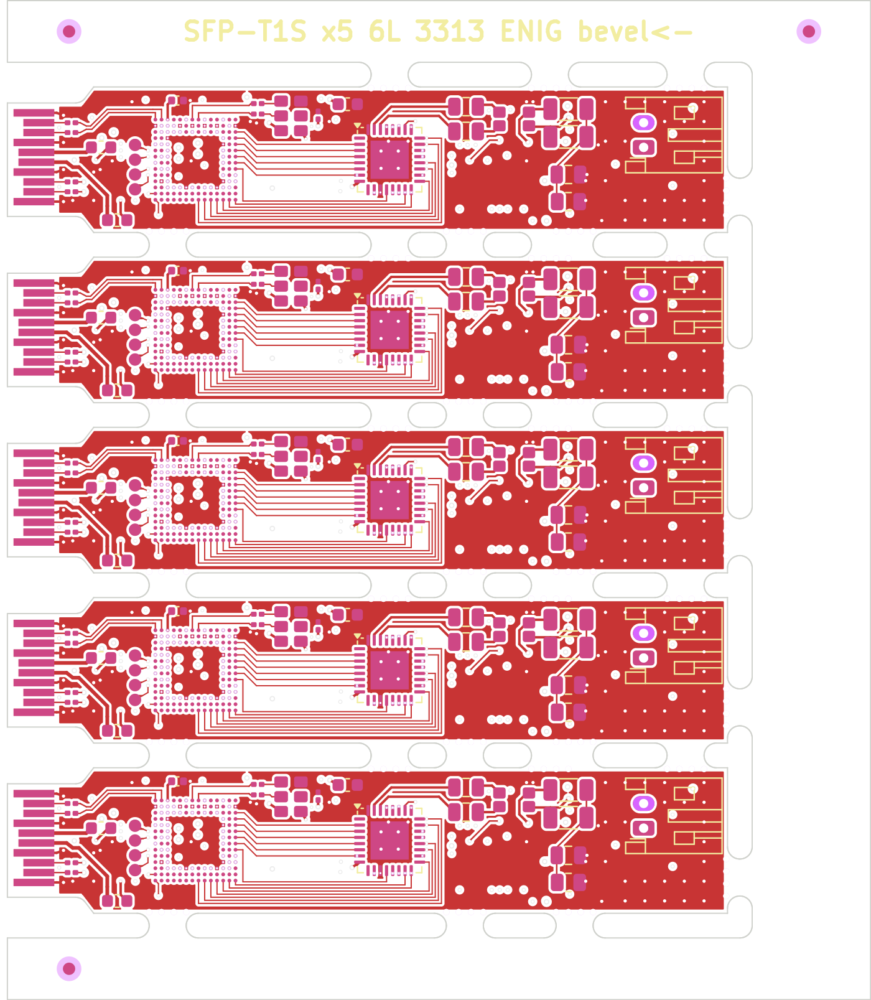

# T1S SFP order sheet (JLCPCB)

Upload the files in `jlc/` as they are (`python3 panel_t1s.py` makes them).

| File | What it is |
|---|---|
| `jlc/t1s-panel-gerbers.zip` | 5-board panel, **70.1 × 81.1 mm**. Gerbers (6 copper layers, masks, silks, paste, outline) + drill |
| `jlc/bom-t1s.csv`, `jlc/cpl-t1s.csv` | BOM 31 lines, CPL **405 placements** (110 top, 295 bottom; designators `R4_1…R4_5`). The JST connector J2 is in both (through-hole, JLC fits it) |
| `jlc/panel-drc.rpt` | Panel DRC with the board's own rules: **0 errors, 0 unconnected**. All findings are warnings ("library not in this project" for the placed footprints and KiKit's mouse-bite holes) |
| `jlc/panel-top.png` | Panel preview. The gold fingers sit on the left edge |

The tabs are placed by hand (`TABS` in `panel_t1s.py`), on the stretches of edge a scan found free of copper.

## PCB options (JLC order form)

| Field | Value | Why |
|---|---|---|
| Layers | **6** | |
| Dimensions | panel (in the gerbers) | gold-finger and PCBA minimums (50 mm per side, 70 × 70) |
| Thickness | **1.0 mm** | SFP MSA: 1.0 ± 0.1 over the fingers |
| Stackup | **JLC06101H-3313** | the SGMII pairs are 0.114 / 0.152 mm on 3313 (≈ 100 Ω differential) |
| Impedance control | **yes** | |
| Via covering | **epoxy filled and capped (POFV)** | every used ball inside the outer ring has a via in its pad |
| Min via | **0.15 drill / 0.3 pad** (72 vias, in BGA and PHY pads); the rest 0.2 / 0.35 and 0.25 / 0.45 | the 0.15 mm drill is JLC's smallest and costs extra |
| Min track / space | 0.1 / 0.1 mm (between the ball vias) | |
| Surface finish | **ENIG** | gold fingers, and the 0.5 mm BGA |
| Gold fingers | **yes**, bevel **45°**, **the panel's left edge** | |
| PCB quantity | 5 panels | |
| Panel by JLC | no (we supply the panel) | |

## Assembly options

| Field | Value |
|---|---|
| Type | **Standard** |
| Sides | **both** |
| Quantity | 2 panels = 10 boards |
| Through-hole | J2 (JST PH, 2 joints per board) |
| X-ray | **yes**: the 0.5 mm BGA (U1) |
| Files | `jlc/bom-t1s.csv` + `jlc/cpl-t1s.csv` |

**Check part rotations in JLC's 3D preview**, above all U1 (the BGA's ball A1), U5 (the PHY), U2 (the flash is turned 180°) and U8.

## Cost

Not estimated: the FPGA's price at quantity 10 and the 6-layer PCB with 0.15 mm via-in-pad are both quote-only items. Get JLC's quote before ordering; this board is likely over the 500,000 KRW budget on its own.

## Before ordering

- The flash is blank from the factory: the FPGA will not configure until it is programmed over JTAG (TP10–TP13, on top beside the FPGA).
- Read [README.md](README.md#what-is-not-verified): the transceiver IP, synthesis and timing are not done.
