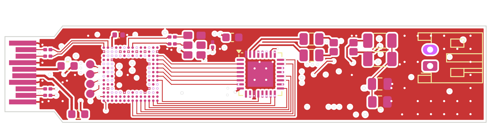
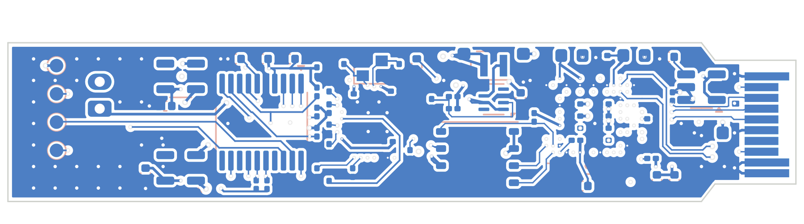

# T1S SFP: 10BASE-T1S

No 10BASE-T1S PHY speaks SGMII (they are all MII/RMII or SPI MAC-PHYs; see [../../docs/PARTS.md](../../docs/PARTS.md)).
So an FPGA sits between the two:
- the host's SGMII on a hard transceiver lane;
- our own PCS, ×100 rate adaptation, frame FIFOs and half-duplex MAC in fabric ([gw/](gw/));
- MII to a Microchip LAN8670.

**This is the board with the most unverified pieces.** See [What is not verified](#what-is-not-verified).

Schematic, 6-layer PCB (routed), fab outputs and a JLC panel are in place; the order sheet is [ORDER.md](ORDER.md). Nothing has been built.

| Top | Bottom |
|---|---|
|  |  |

## Status

| | Result | How it was checked |
|---|---|---|
| Schematic | **ERC 0 errors** ([erc.rpt](erc.rpt)); 2 warnings, both "symbol differs from the library copy" (the two LDOs) | eeschema's own ERC (`run_erc.sh`) |
| Placement | 91 parts, no overlaps; housing height limits met | `make_t1s.py` |
| Routing | **DRC 0 violations, 0 unconnected** ([drc.rpt](drc.rpt)) | hand-laid pairs, escapes and In2 buses, Freerouting 1.9.0 for the rest ([t1s.ses](t1s.ses), rebuilt with `--reuse-ses`), then KiCad DRC |
| KiCad 9 | **DRC 0 errors, 0 unconnected, schematic parity clean, ERC 0 errors** ([kicad9-drc.rpt](kicad9-drc.rpt), [kicad9-erc.rpt](kicad9-erc.rpt)) | `sh ../check_kicad9.sh t1s`. Only warnings are "differs from the library copy" |
| Fab | Gerbers + drill ([fab/t1s-gerbers.zip](fab/t1s-gerbers.zip)), [BOM](fab/t1s-bom.csv), [CPL](fab/t1s-cpl.csv), [1:1 print](fab/t1s-1to1.pdf) | `export_t1s.py` |
| Panel | 5 boards, 70.1 × 81.1 mm, **DRC 0 errors, 0 unconnected** with the board's rules ([jlc/panel-drc.rpt](jlc/panel-drc.rpt)) | `panel_t1s.py` (KiKit) |
| Gateware | `tb_bridge`, `tb_top` pass | Icarus Verilog, CI |
| Firmware | builds, 0 warnings | `make VARIANT=t1s`, CI |

## Parts

| | Part | LCSC | Why |
|---|---|---|---|
| FPGA | Gowin **GW5AT-LV15MG132C1/I0** | C54067362 | The only FPGA with real transceivers that fits the width (8 × 8 mm) and is in JLC stock |
| PHY | Microchip **LAN8670C2-E/LMX** | C20901523 | MII + PLCA, 5 × 5 VQFN (B1/C1 variants have no stock) |
| Reference | YXC OB2EL89CLIB112YLC-125M, 125 MHz LVDS 3225 | C7425465 | As the Gowin kit: LVDS, AC coupled at the FPGA |
| Configuration | GD25Q64CWIGR, 64 Mbit SPI NOR, WSON-8 | C395511 | Gowin wants ≥ 64 Mbit (its retry image sits at 0x800000) |
| Core 0.946 V | TPS62822 buck | C473385 | Same circuit as the RJ45 board (57.6k / 100k) |
| 1.8 V, 1.2 V | TLV75518 / TLV75512, SOT-23-5 | C2877863 / C2877864 | VDDHAQ0; VDD12M + VCCLDO |
| MDI | ACT1210E-241 CMC, 2 × 100 nF 100 V, 49.9 Ω end-node termination | C6114822 … | Microchip AN1718 "BIN" |
| Connector | JST PH S2B-PH-K-S, 2 pins, right angle | C173752 | Wire to board, outside the cage |
| MCU | STM32G031F6P6 | C529333 | As the other boards: EEPROM, PHY bridge, TX_DISABLE / RX_LOS |

## Board

- 58.4 × 11.8 mm. The JST housing sits entirely past the cage front (44.3 mm).
- **Six layers:**

  | Layer | Use |
  |---|---|
  | F | FPGA balls, SGMII RX and the reference clock, MII, the MDI network, JTAG pads |
  | In1 | GND |
  | In2 | signals: the long buses (below), the ball field's escapes |
  | In3 | +3V3 plane |
  | In4 | GND, with the 0.95 V core as an island under the FPGA and the buck |
  | B | the TX pair, decaps, flash, buck, PHY straps, MCU, LDOs, test pads |

- **Why six:** 0.5 mm ball pitch leaves no room for a track between balls. So every used ball inside the outer ring has a **via in its pad** (0.3 / 0.15 mm, filled and capped), and five supply rails sit interleaved around the ring. On six layers JLC fills and caps via-in-pad at no extra charge, and +3V3 and the core rail become planes the router doesn't have to route.
- **The core island is on In4, not In2.** On In2 it covered the ball field, so the small rails (VDDHAQ, V1P2) and the inner-ring signals had no way out. Under B only the field's stubs and decaps sit on it; the TX pair crosses it only on its last 0.75 mm into the balls.
- **Two In2 buses, laid by hand** (`IN2_BUS` in `make_t1s.py`, found once by a maze search over the board before its dogbones went in):
  - along the north edge, SDA, TX_DISABLE and TX_FAULT from the fingers to MCU pins 1-3;
  - along the south edge, from the ball field and the fingers to the MCU's bottom row, one lane each, stacked in the order the pins take them: V1P2 (to its LDO), RECONFIG_N, DONE, SCL above the pins' via row, FPGA_LINK and RX_LOS below it;
  - VDDHAQ leaves the ball field through row C and runs under the MCU to its LDO; MISO crosses over the flash.
  The MCU's pins follow the buses: TX_DISABLE / TX_FAULT are on PC14 / PC15 here (PA4 / PA6 on the other boards).
- **Around the ball field:** JTAG leaves west on In2 to four pads on top beside the FPGA; the flash is turned 180° so CLK and MOSI reach it underneath; CRS, RXD0 and TXEN reach their straps through vias in the PHY's pads.
- **SGMII pairs** (0.114 / 0.152 mm, coupled):
  - RX on F over In1.
  - TX on B over In4. It leaves the ball field through its two via-in-pads, with 0.1 mm necks between the neighbouring ball vias.
- **Polarity:** both pairs are laid straight. That leaves RX inverted (TD+ lands on RXM), and the gateware inverts the words (`gw/t1s_top.v`, `RX_INVERT`; `tb_top` checks it). The reference clock is also inverted, so the two lanes to the oscillator don't cross. That changes nothing.

## Regenerating

```bash
python3 make_t1s.py            # symbols, footprints, schematic, placed PCB
python3 make_t1s.py --route    # planes, dogbones, Freerouting, pours, repairs, DRC -> drc.rpt
sh ../check_kicad9.sh t1s      # the same board in KiCad 9
python3 export_t1s.py          # gerbers (6 copper layers), BOM, CPL, previews, 1:1 PDF
python3 panel_t1s.py           # 5-board panel + JLC files -> jlc/
```

## What is not verified

- **Hardware:** nothing has been built.
- **Gowin toolchain:**
  - The transceiver is Gowin's *Customized PHY* IP. It is generated in Gowin EDA with the settings in `gw/serdes_lane.v`, plus a small shim of ports. Neither exists yet.
  - Synthesis and timing have not been run.
- **Refclk choice:** 125 MHz for 1.25 Gb/s is the usual choice, but it has not been checked in Gowin's IP generator.
- **MIPI rails:** Gowin does not say whether they may stay unpowered, so they are powered (VDD12M 1.2 V, VDDAM on the core rail, VDDXM on 3.3 V).
- **LAN8670 land:** the exposed pad uses KiCad's VQFN-32 5 × 5 land with a 3.1 mm EP. Check it against the LMX package drawing before ordering.
- **Firmware** (`fw/`, `VARIANT=t1s`) builds but has never run: FPGA DONE / RECONFIG_N handling, the LAN8670's AN1699 set-up and PLCA over MDIO, RX_LOS from `FPGA_LINK` ([../../fw/README.md](../../fw/README.md)).
- **MDI polarity:** the pair leaves the PHY swapped (pins 30/31) so it does not cross itself on the way to its caps. 10BASE-T1S is DME coded, which is polarity-insensitive; check it on a real segment.
- **Fab limits:**
  - via-in-pad 0.15 mm drill (72 of them: the ball field, a few PHY pads);
  - 0.1 mm lines between ball vias;
  - 0.2 mm hole-to-copper.

  Confirm all three against JLC's 6-layer DFM before ordering.
